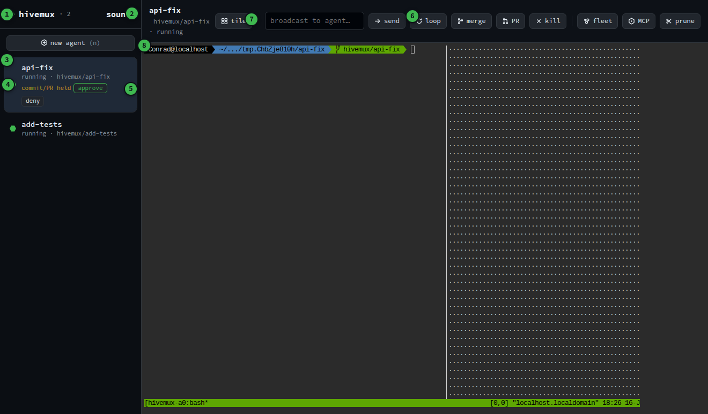
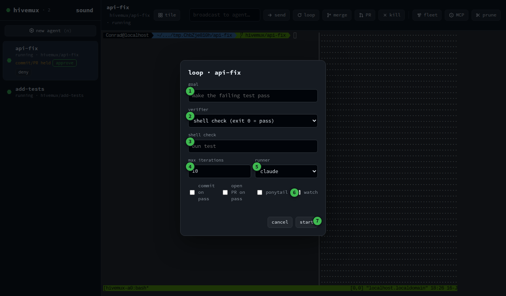

# hivemux GUI runbook

What every control in the `hivemux gui` window does. For CLI recipes see
[GUIDE.md](GUIDE.md); for the command reference see the [README](../README.md).

## Launch it

```bash
hivemux gui                 # opens a desktop app window on http://127.0.0.1:7878
hivemux gui --port 9000     # pick another port
```

Needs `ttyd` (embeds the live terminals) and a browser. If Chrome/Chromium is
present it opens in a frameless `--app` window; otherwise it prints the URL for
you to open. The window is just a frontend over the same tmux-backed core as the
CLI: anything you do in the GUI you can also do from `hivemux ...`, and the two
stay in sync over server-sent events.

If you run it on a remote box, forward the port and the GUI works the same:
`ssh -L 7878:127.0.0.1:7878 you@box` then open `http://127.0.0.1:7878`.

---

## Layout



The numbered callouts above:

| # | Region | What it is |
|---|--------|------------|
| 1 | **Brand + count** | the hive mark and live agent count; the hex dot glows green when the SSE stream is connected |
| 2 | **sound** | toggle the finish chime + desktop notification |
| 3 | **Workspace row** | one agent; click it to show its terminal in the main pane |
| 4 | **Status ring** | the agent's state at a glance (colour legend below) |
| 5 | **Approval hold** | `commit/PR held` with inline **approve** / **deny** (only when a loop is waiting on you) |
| 6 | **Toolbar** | every action: loop, fleet, MCP, merge, PR, kill, prune (full table below) |
| 7 | **tile** | toggle the tiled grid of all terminals |
| 8 | **Main pane** | the selected agent's live terminal (embedded ttyd) |

### Header
- **⬡ hivemux (n)**: the hive mark plus the live agent count. The hex dot glows
  green when the daemon/SSE stream is connected.
- **sound**: toggle the finish chime (and browser notification) that fires when
  an agent finishes. Click once to arm audio (browsers block sound until you
  interact). Reads `muted` when off; the choice is remembered in localStorage.

### Sidebar (one row per agent)
Click a row to show that agent's terminal in the main pane.

The **hex ring** on each row is the status at a glance:

| Ring colour | Status | Meaning |
|---|---|---|
| Green | `running` | agent process alive and working |
| Yellow (pulsing) | `waiting` | needs input / blocked |
| Cyan | `done` | finished this turn |
| Red (pulsing) | `error` | last turn failed |
| Grey | `dead` | tmux session gone (prune it) |

Under the name: live **token count, context-window fill, and estimated cost**.
A row whose loop is holding a commit/PR for approval shows **commit/PR held**
with inline **approve** / **deny** buttons (see [Approvals](#approvals)).

---

## Toolbar

Everything the CLI and MCP server expose, driven from buttons.

| Button | Does | CLI equivalent |
|---|---|---|
| **+ new agent** | open the new-agent form (name, repo, branch, base) | `hivemux new` |
| **broadcast …** | type a prompt + send it to the selected agent's session | `hivemux broadcast` |
| **loop** | open the verify→fix loop form (see below) | `hivemux loop` |
| **merge** | merge the selected agent's branch into the base | `hivemux merge` |
| **PR** | open a pull request from the selected agent's branch | `hivemux pr` |
| **kill** | stop the selected agent (optionally remove its worktree) | `hivemux kill` |
| **fleet** | run one goal across N fresh agents at once | `hivemux loop --fleet` |
| **MCP** | show the in-app MCP panel (drive the fleet from an MCP client) | `hivemux mcp` |
| **prune** | remove agents whose tmux session is gone (grey rings) | `hivemux prune` |
| **tile** | toggle the tiled grid: every agent's terminal at once | `hivemux gui` tile view |

---

## New-agent form

| Field | Meaning | Default |
|---|---|---|
| **name** | agent + branch + tmux session name (e.g. `fix-auth`) | required |
| **repo** | path to the git repo to branch from | current dir (`.`) |
| **branch** | branch to create for the worktree | `hivemux/<name>` |
| **base** | branch to fork from | repo default branch |

**create** spins up an isolated git worktree + tmux session and launches the agent.

---

## Loop form

A loop drives an agent **verify → fix → verify** until the goal passes or it hits
the iteration cap. Open it with **loop** (or **fleet** for the multi-agent form).



| # | Control | Meaning |
|---|---------|---------|
| 1 | **goal** | what the agent should achieve, in plain language |
| 2 | **verifier** | choose a shell **check** (exit 0 = pass) or an **LLM judge (rubric)** |
| 3 | **shell check / rubric** | the check command (e.g. `bun test`), or the rubric text when the judge is selected |
| 4 | **max iterations** | give up after this many verify→fix rounds |
| 5 | **runner** | which agent CLI runs it (claude / a configured runner) |
| 6 | **ponytail / watch** | ponytail = bias to the smallest fix; watch = stream the agent's reasoning into its pane (see [Watch](#watch-mode)) |
| 7 | **start** | launch the loop in the background |

`commit on pass` / `open PR on pass` (the two checkboxes left of ponytail) land the
work automatically when the goal passes; the **fleet** form adds a **fleet size**
field to run the same goal on N fresh agents and race them.

**start** launches the loop in the background; the sidebar ring and cost update
live as it iterates. **loop history** shows past loop runs; click one to read its
full log.

> Safety: loops always run with `acceptEdits`, never `--dangerously-skip-permissions`.
> A per-agent cost cap and the global policy in `~/.hivemux/config.json` both apply.

---

## Watch mode

A headless loop agent is normally invisible; its terminal tile just shows a
shell. Tick **watch** (or pass `--watch` on the CLI) and hivemux runs the agent in
streaming mode and mirrors its **live reasoning, tool calls, and turn cost** into
its terminal pane. Combined with [tile view](#tile-view), you can watch every
agent think at once.

What you see in the pane:

```
hivemux watch · fixadd
goal: fix the bug in calc.py so test.sh passes

[tool: Bash]
[tool: Read]
[tool: Edit]
Fixed. `add` returned `a - b`; changed to `a + b`. add(2,3)==5 now holds.
[turn done $0.3407]
```

---

## Tile view

**tile** toggles a grid of every agent's terminal at once, so you don't click
through the sidebar one at a time. Click a tile to focus that agent.

**Finish-flash**: the moment an agent finishes, its tile **lights up, blinks**,
and (if sound is on) plays a chime, so you notice completions across a busy grid
without watching. The glow clears when you click the tile.

---

## Approvals

If the policy sets `requireApproval: true` (in `~/.hivemux/config.json`), a loop
that wants to **commit or open a PR** does not do it automatically. Instead the
agent's sidebar row shows **commit/PR held** with two buttons:

- **approve**: perform the held commit/PR and clear the hold.
- **deny**: discard the held action.

This is the omnigent-style governance gate: the agent does the work, you keep the
final say on anything that leaves the worktree. CLI equivalents: `hivemux approve
<name>` / `hivemux deny <name>`.

---

## MCP panel

**MCP** opens a panel with:

- the **command** to register hivemux as an MCP server (`hivemux mcp`),
- a copy-paste **client config** block (the **copy config** button copies it),
- the **live tool list** with a count, so a conductor agent can see exactly which
  tools (`spawn_agent`, `start_loop`, `get_status`, `merge`, …) it can call.

Point any MCP client (Claude Code/Desktop, Cursor, …) at it and a conductor agent
can spawn workers, start loops, watch status, and merge passes for you.

---

## Troubleshooting

- **"Failed to start server. Is port 7878 in use?"**: another hivemux/ttyd is
  already on that port. Close it, or use `--port`. Find a stray one with
  `ps -ef | grep -E 'hivemux|ttyd'` and `kill <pid>`.
- **Terminal tile shows a broken image**: ttyd wasn't ready when the tile
  mounted; tiles auto-reload once shortly after opening, so give it a second.
- **No sound on finish**: click **sound** once to arm audio (browsers block it
  until you interact with the page) and allow notifications if prompted.
- **A grey (dead) row won't go away**: its tmux session is gone; click **prune**.
